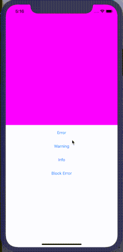
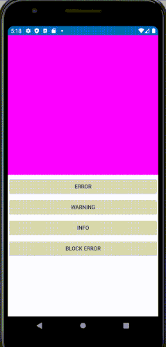

  
  
# Welcome to Xam.Forms.GraceAlert




Hi! I'm [Mark Jack Milian](http://markjackmilian.net/) and i'm here to aswer a few questions


## Packages ##


Platform/Feature               | Package name                              | Stable      | Status 
-----------------------|-------------------------------------------|-----------------------------|------------------------
Core             | `Xam.Zero.Sem` | [](https://www.nuget.org/packages/Xam.Forms.GraceAlert) | [](https://dev.azure.com/nightlybuilds-net/Xam.GraceAlert/_build/latest?definitionId=18&branchName=master)|

All packages are compliant with [Semantic Versioning](https://semver.org/)


## What is Xam.Forms.GraceAlert?

Is a Xamarin Forms View to show non invasive notification for alert, warning and info.


## How does it works?

### Page Structure
Please add a reference of our nuget to your Cross-Platform Xamarin.Forms project.

Add a GraceAlertView as **first** element of your page and add you "normal" inside GraceAlertView.BodyContent
```xaml
<graceAlert:GraceAlertView>
    <graceAlert:GraceAlertView.BodyContent>
        <ContentView>
            <YOUR_CONTENT_HERE>
        </ContentView>
    </graceAlert:GraceAlertView.BodyContent>
</graceAlert:GraceAlertView>
```
### Show a notification
To show a notification use the extension method on Page. *Never call the directly methods on GraceAlertView.*
```xaml
Error(this Page page, string title, string text, bool block = false):Task
Warning(this Page page, string title, string text, bool block = false):Task
Info(this Page page, string title, string text, bool block = false):Task
```

If block is true the notification will remain on the screen until you touch it.


## Samples

 - Xamarin.Forms.Example in this repo; 
